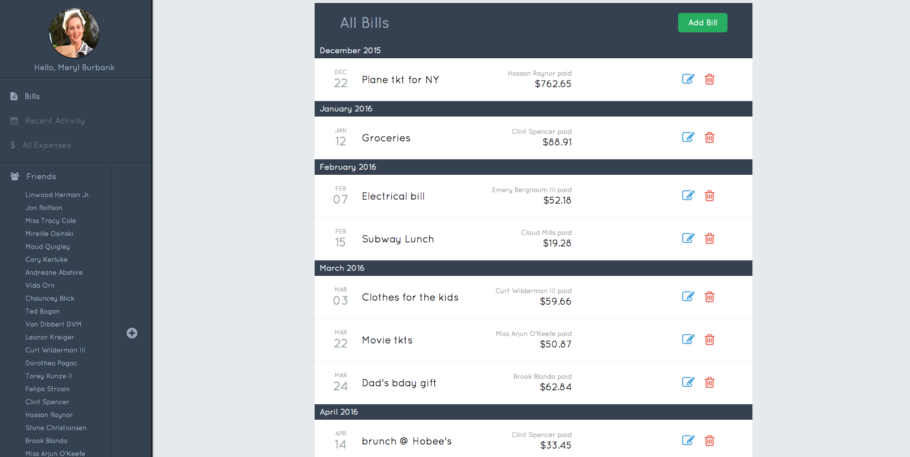
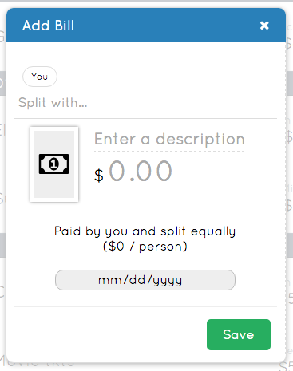
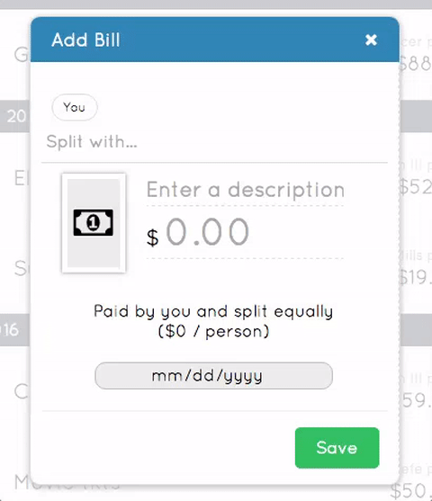

# Diffindo

Diffindo is a web app inspired by SplitWise. It allows users to generate, settle and keep track of split bills with other users.

The backend runs on Ruby on Rails and PostgreSQL, while the frontend relies on Facebook's React.js using a Redux architectural framework.


## Features Added So Far

Diffindo is a WIP, but some core features have already been implemented:

| Feature | Status | Comment |
|--------------------------------------------|:-----------:|:-------------------:|
| Create a new account | DEPLOYED | |
| Login as a guest user to demo the app | DEPLOYED | |
| View, create, edit and delete bills | DEPLOYED | |
| Add friends | In Progress | Possible to add a friend through e-mail, but no confirmation is sent yet. |
| Split bills with friends | DEPLOYED | |
| Create Groups                              | | |
| Upcoming bills                             | | |
| Monthly trend                              | | |
| Settling bills - manually record payment   | | |
| Settling bills - send money through PayPal | | |
| Bill creation - add PDF image              | | |
| Split option                               | | |
| Bill category                              | | |


## Implementation

### Bills CRUD
Bills are the core of Diffindo, with each record storing the following:
| Column | Type | Constraint |
|------|:-----------:|:-------:|
| title | string | null: false |
| amount | float | null: false |
| category_id | integer | null: false |
| author_id | integer | null: false |
| payer_id | integer | null: false |
| date | date | null: false |
| doc_url | string | |
| split_type | string | null: false |
| created_at | datetime | null: false |
| updated_at | datetime | null: false |

When a user logs in, an API call is dispatched to retrieve all bills that the user has:
* created, joining the user and bills tables through `users.id` and `bills.author_id`;
* paid, joining the user and bills tables through `users.id` and `bills.payer_id`;
* split, joining the user and bills tables through a join table called `splits` (more on that later)

The information returned is in JSON form, being then stored in a store slice called `bills` for quick access. `bills` gets cleared when the session is destroyed (user logs out).

All bills relevant to the user are displayed as a list, being rendered by the `Bills` component. Each list item gets the corresponding `bill.id`, so it will know which bill to render when in edit mode:



The bills are grouped by their month, forming an array of bill objects. Iterating through this array, all bills are then rendered as `<li>`:

```javascript
<ul className="bills-list">
  {this.props.bills[monthIndex].map( bill => (
    <li key={`bill-${bill.id}`} className="bill-item row clearfix">
    {BillInformation}
    <i className="fa fa-pencil-square-o"
      aria-hidden="true" onClick={this.openModal(bill.id)}/>
    </li>
  )}
</ul>
```


When the **Add Bill** button is pressed, the `BillModal` component takes over, displaying the bill creation interface. Here is where all the magic happens:



Clicking on the blue icon next to each bill opens the same `BillModal` in edit mode. The difference here is that a `GET` request is sent to the server in order to fetch the corresponding bill.

#### Splitting
While splitting may look easy on screen, there's a lot going on in the background:


Whenever a bill is created, a `POST` API call gets dispatched with all relevant data, according to the schema above. Added to that data is information regarding how the bill is being split and with whom. Such data is sent as an array of objects with keys `user_id` and `amount`. When these parameters hit Rails, new `splits` records are automatically created by the `Bill` modal. Should an error occur while the transaction is happening, such as the user forgetting to add the amount of the bill, a rollback happens and the `splits` records are never created.
